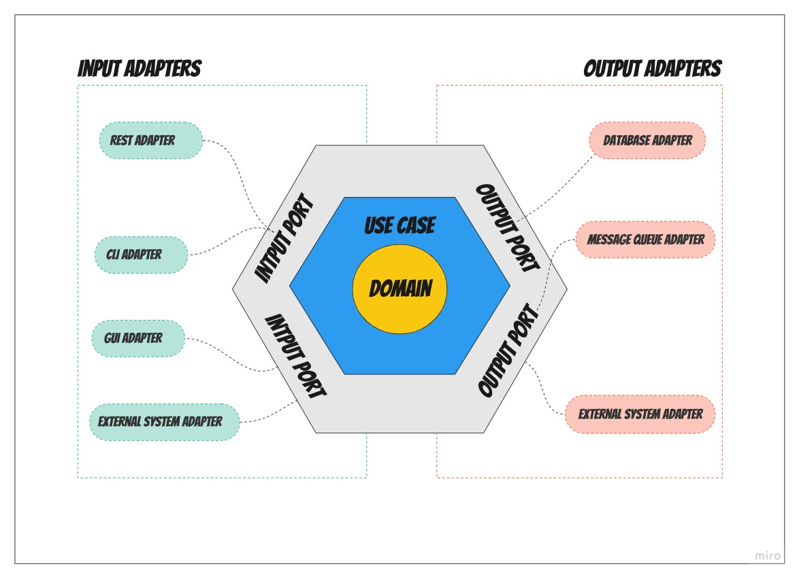
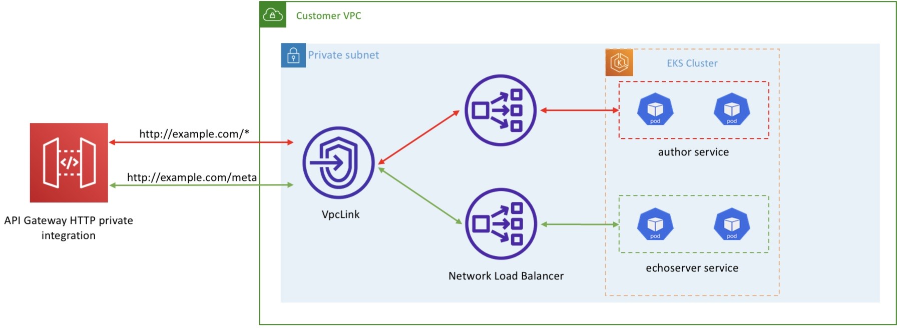
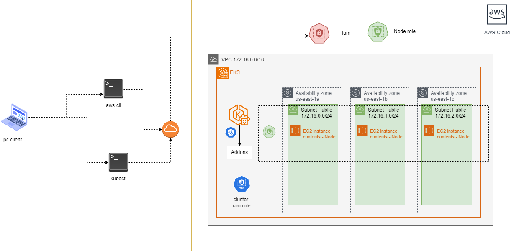
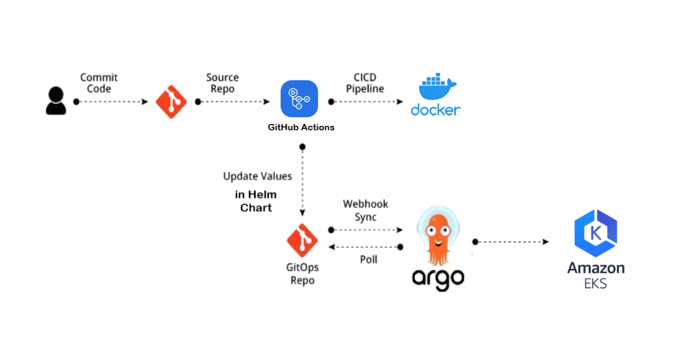

# api-utec-customer-microservice

api-utec-customer-microservice

<!-- TOC -->
* [api-utec-customer-microservice](#api-utec-customer-microservice)
* [📖 Overview](#-overview)
* [📑 Prerequisite](#-prerequisite)
  * [🖥️ Technologies y Language](#-technologies-y-language)
  * [Architecture](#architecture)
* [⚙️ Spring Boot Dependencies 🧱](#-spring-boot-dependencies-)
* [🚀 Terraform](#-terraform)
* [🚀 Deploy](#-deploy)
* [Arquitectura](#arquitectura)
<!-- TOC -->

# 📖 Overview

Este proyecto se trabaja en una arquitectura hexagonal (puertos y adaptadores) + vertical slicing

- Infrastructure puede conocer a Domain y Application.

- Application solo puede conocer a Domain y no a Infrastructure.
- Domain no conoce a nadie.
- El acceso a la lógica del dominio desde el exterior está disponible a través de puertos y adaptadores.
- La arquitectura hexagonal define la parte interna y la externa.
- Application (exterior), dominio(interior) e infraestructura (exterior)
- A través de la capa de aplicación, el usuario o cualquier otro programa interactúa con la aplicación.
- En la capa de dominio, guardamos el código que toca e implementa la lógica de negocios.
- La capa de infraestructura es la parte que contiene lo que la aplicación necesita para funcionar.

# 📑 Prerequisite

## 🖥️ Technologies y Language

|    Name     | Version |
|:-----------:|:-------:|
|     JDK     |   17    |
|    Maven    |  3.9.2  |
| Spring Boot |  3.3.1  |
|    MySql    |    8    |

## Architecture

- Hexagonal
- 

# ⚙️ Spring Boot Dependencies 🧱

```xml

<dependencies>

    <dependency>
        <groupId>org.springframework.boot</groupId>
        <artifactId>spring-boot-starter-data-jpa</artifactId>
    </dependency>

    <dependency>
        <groupId>org.springframework.boot</groupId>
        <artifactId>spring-boot-starter-web</artifactId>
    </dependency>

    <dependency>
        <groupId>org.springframework.boot</groupId>
        <artifactId>spring-boot-devtools</artifactId>
        <scope>runtime</scope>
        <optional>true</optional>
    </dependency>

    <dependency>
        <groupId>org.projectlombok</groupId>
        <artifactId>lombok</artifactId>
        <optional>true</optional>
    </dependency>


    <dependency>
        <groupId>mysql</groupId>
        <artifactId>mysql-connector-java</artifactId>
        <version>8.0.28</version>
        <scope>runtime</scope>
    </dependency>

    <dependency>
        <groupId>org.modelmapper</groupId>
        <artifactId>modelmapper</artifactId>
        <version>3.2.0</version>
    </dependency>

    <dependency>
        <groupId>org.mapstruct</groupId>
        <artifactId>mapstruct</artifactId>
        <version>1.5.5.Final</version>
    </dependency>

    <dependency>
        <groupId>org.springdoc</groupId>
        <artifactId>springdoc-openapi-starter-webmvc-ui</artifactId>
        <version>2.3.0</version>
    </dependency>
    <dependency>
        <groupId>org.springdoc</groupId>
        <artifactId>springdoc-openapi-starter-webmvc-api</artifactId>
        <version>2.6.0</version>
    </dependency>
    <dependency>
        <groupId>org.springframework.boot</groupId>
        <artifactId>spring-boot-starter-test</artifactId>
        <scope>test</scope>
    </dependency>

    <dependency>
        <groupId>org.springframework.boot</groupId>
        <artifactId>spring-boot-configuration-processor</artifactId>
        <scope>compile</scope>
    </dependency>

</dependencies>

```

# 🚀 Terraform

Module ECR

```terraform
resource "aws_ecr_repository" "this" {
  name                 = var.repository_name
  image_tag_mutability = var.image_tag_mutability
  image_scanning_configuration {
    scan_on_push = var.image_scanning_configuration
  }
  tags = var.tags
}

output "repository_id" {
  description = "The ID of the ECR repository."
  value       = aws_ecr_repository.this.id
}

output "repository_arn" {
  description = "The ARN of the ECR repository."
  value       = aws_ecr_repository.this.arn
}

output "repository_uri" {
  description = "The URI of the ECR repository."
  value       = aws_ecr_repository.this.repository_url
}
# modules/ecr/variables.tf

variable "repository_name" {
  description = "The name of the ECR repository."
  type        = string
}

variable "image_tag_mutability" {
  description = "Enable tag immutability to prevent image tags from being overwritten by subsequent image pushes using the same tag. Disable tag immutability to allow image tags to be overwritten."
  type        = string
  default     = "MUTABLE"
}
variable "image_scanning_configuration" {
  description = "Enable scan on push to have each image automatically scanned after being pushed to a repository. If disabled, each image scan must be manually started to get scan results."
  type        = bool
  default     = false
}

variable "tags" {
  description = "Tags to apply to the repository."
  type = map(string)
  default = {}
}
terraform {
  required_version = ">= 1.0"
  required_providers {
    aws = {
      source  = "hashicorp/aws"
      version = "5.59.0"
    }
  }
}

provider "aws" {
  region = "us-east-1"
}

````

Module VPC

```terraform
################################################################################
# LOCALS
################################################################################
locals {
  az_count = length(data.aws_availability_zones.available.names)
  # Define the number of subnets for public and private
  public_subnet_count = var.public_subnet_count
  private_subnet_count = var.private_subnet_count
  # Generate CIDR blocks for public subnets dynamically
  public_subnet_cidr = [
    for i in range(local.public_subnet_count) : cidrsubnet(var.vpc_cidr, 8, i)
  ]
  # Generate CIDR blocks for private subnets dynamically
  private_subnet_cidr = [
    for i in range(local.private_subnet_count) : cidrsubnet(var.vpc_cidr, 8, local.public_subnet_count+i)
  ]


  public_subnets = [
    for i, cidr in local.public_subnet_cidr : {
      cidr_block        = cidr
      availability_zone = data.aws_availability_zones.available.names[i%local.az_count]
    }
  ]
  private_subnets = [
    for i, cidr in local.private_subnet_cidr : {
      cidr_block        = cidr
      availability_zone = data.aws_availability_zones.available.names[i%local.az_count]
    }
  ]
}
################################################################################
# DATA
################################################################################
data "aws_availability_zones" "available" {}
################################################################################
# VPC
################################################################################
resource "aws_vpc" "this" {
  cidr_block           = var.vpc_cidr
  enable_dns_hostnames = true
  enable_dns_support   = true
  tags = {
    Name = var.vpc_name
  }
}
################################################################################
# Internet Gateway
################################################################################
resource "aws_internet_gateway" "this" {
  vpc_id = aws_vpc.this.id
  tags = {
    Name = "${var.vpc_name}-igw"
  }
}
################################################################################
# Public Subnets
################################################################################
resource "aws_subnet" "public" {
  count = length(local.public_subnets)
  vpc_id                  = aws_vpc.this.id
  cidr_block              = local.public_subnets[count.index].cidr_block
  availability_zone       = local.public_subnets[count.index].availability_zone
  map_public_ip_on_launch = true
  tags = {
    Name = "${var.vpc_name}-subnet-public-${count.index}"
  }
}
################################################################################
# Private Subnets
################################################################################
resource "aws_subnet" "private" {
  count = length(local.private_subnets)
  vpc_id                  = aws_vpc.this.id
  cidr_block              = local.private_subnets[count.index].cidr_block
  availability_zone       = local.private_subnets[count.index].availability_zone
  map_public_ip_on_launch = true
  tags = {
    Name = "${var.vpc_name}-subnet-private-${count.index}"
  }
}
################################################################################
# Table route public
################################################################################
resource "aws_route_table" "public" {
  vpc_id = aws_vpc.this.id
  route {
    cidr_block = "0.0.0.0/0"
    gateway_id = aws_internet_gateway.this.id
  }
  tags = {
    Name = "${var.vpc_name}-public-rt"
  }
}
################################################################################
# Table route associate public
################################################################################
resource "aws_route_table_association" "public" {
  count = length(aws_subnet.public)
  subnet_id      = aws_subnet.public[count.index].id
  route_table_id = aws_route_table.public.id
}
################################################################################
# Table route private
################################################################################
resource "aws_route_table" "private" {
  vpc_id = aws_vpc.this.id
  tags = {
    Name = "${var.vpc_name}-private-rt"
  }
}
################################################################################
# Table route associate private
################################################################################
resource "aws_route_table_association" "private" {
  count = length(aws_subnet.private)
  subnet_id      = aws_subnet.private[count.index].id
  route_table_id = aws_route_table.private.id
}


################################################################################
# Security group cluster
################################################################################

resource "aws_security_group" "security_group" {
  name        = "${var.vpc_name}-sg"
  description = "Allow TLS inbound traffic and all outbound traffic"
  vpc_id      = aws_vpc.this.id

  ingress {
    from_port = 443
    to_port   = 443
    protocol  = "tcp"
  }

  ingress {
    description = "HTTP over Internet"
    from_port   = 0
    to_port     = 0
    protocol    = "tcp"
    cidr_blocks = ["0.0.0.0/0"]
  }

  egress {
    from_port = 0
    to_port   = 0
    protocol  = "-1"
    cidr_blocks = ["0.0.0.0/0"]
    ipv6_cidr_blocks = ["::/0"]
  }

  tags = {
    Name = "${var.vpc_name}-sg"
  }
}

output "vpc_id" {
  value = aws_vpc.this.id
}

output "public_subnet_ids" {
  value = aws_subnet.public[*].id
}

output "private_subnet_ids" {
  value = aws_subnet.private[*].id
}
output "security_group_id" {
  value = aws_security_group.security_group.id
}

variable "vpc_name" {
  description = "The name of the VPC."
  type        = string
}

variable "vpc_cidr" {
  description = "The CIDR block for the VPC."
  type        = string
}

variable "public_subnet_count" {
  description = "Number of public subnets."
  type        = number
  default     = 2
}

variable "private_subnet_count" {
  description = "Number of private subnets."
  type        = number
  default     = 2
}

terraform {
  required_version = ">= 1.0"
  required_providers {
    aws = {
      source  = "hashicorp/aws"
      version = "5.59.0"
    }
  }
}

provider "aws" {
  region = "us-east-1"
}
```

Module EKS

```terraform
################################################################################
# DATA FOR EKS CLUSTER
################################################################################
data "aws_iam_policy_document" "aws_iam_policy_data_eks" {
  statement {
    effect = "Allow"

    principals {
      type = "Service"
      identifiers = ["eks.amazonaws.com"]
    }

    actions = ["sts:AssumeRole"]
  }
}
################################################################################
# ROLE FOR EKS CLUSTER
################################################################################
resource "aws_iam_role" "eks_iam_role" {
  name               = "${var.cluster_name}-eks-role"
  assume_role_policy = data.aws_iam_policy_document.aws_iam_policy_data_eks.json

  tags = {
    Name = "${var.cluster_name}-eks-role"
  }
}
################################################################################
# POLICY_ATTACHMENT CLUSTER
################################################################################
resource "aws_iam_role_policy_attachment" "eks_service_policy" {
  policy_arn = "arn:aws:iam::aws:policy/AmazonEKSServicePolicy"
  role       = aws_iam_role.eks_iam_role.name
}
resource "aws_iam_role_policy_attachment" "eks_cluster_policy" {
  policy_arn = "arn:aws:iam::aws:policy/AmazonEKSClusterPolicy"
  role       = aws_iam_role.eks_iam_role.name
}
resource "aws_iam_role_policy_attachment" "eks_vpc_resources_policy" {
  policy_arn = "arn:aws:iam::aws:policy/AmazonEKSVPCResourceController"
  role       = aws_iam_role.eks_iam_role.name
}


################################################################################
# DATA FOR EKS NODE
################################################################################
data "aws_iam_policy_document" "aws_iam_policy_data_ec2" {
  statement {
    effect = "Allow"
    principals {
      type = "Service"
      identifiers = ["ec2.amazonaws.com"]
    }

    actions = ["sts:AssumeRole"]
  }
}

################################################################################
# ROLE FOR EKS CLUSTER NODE
################################################################################
resource "aws_iam_role" "node_iam_role" {
  for_each           = var.node_groups
  name               = "${var.cluster_name}-node-role"
  assume_role_policy = data.aws_iam_policy_document.aws_iam_policy_data_ec2.json

  tags = {
    Name = "${var.cluster_name}-node-role"
  }
}
################################################################################
# POLICY_ATTACHMENT NODE
################################################################################
resource "aws_iam_role_policy_attachment" "eks_worker_node_policy" {
  for_each   = var.node_groups
  role       = aws_iam_role.node_iam_role[each.key].name
  policy_arn = "arn:aws:iam::aws:policy/AmazonEKSWorkerNodePolicy"
}
resource "aws_iam_role_policy_attachment" "eks_container_policy" {
  for_each   = var.node_groups
  role       = aws_iam_role.node_iam_role[each.key].name
  policy_arn = "arn:aws:iam::aws:policy/AmazonEC2ContainerRegistryReadOnly"
}
resource "aws_iam_role_policy_attachment" "eks_cni_policy" {
  for_each   = var.node_groups
  role       = aws_iam_role.node_iam_role[each.key].name
  policy_arn = "arn:aws:iam::aws:policy/AmazonEKS_CNI_Policy"
}

################################################################################
# EKS
################################################################################
resource "aws_eks_cluster" "eks_cluster" {
  name     = var.cluster_name
  role_arn = aws_iam_role.eks_iam_role.arn
  version  = var.cluster_version

  vpc_config {
    subnet_ids              = var.subnet_ids
    endpoint_public_access  = var.endpoint_public_access
    endpoint_private_access = var.endpoint_private_access
    security_group_ids      = var.security_group_ids
  }


  depends_on = [
    aws_iam_role_policy_attachment.eks_cluster_policy
  ]


  tags = merge({ "Name" = var.cluster_name })
}
################################################################################
# AWS EKS ADDON
################################################################################
resource "aws_eks_addon" "eks_addon" {
  for_each      = var.cluster_addons
  cluster_name  = aws_eks_cluster.eks_cluster.name
  addon_name    = each.key
  addon_version = each.value.version != "" ? each.value.version : null
  depends_on = [
    aws_eks_cluster.eks_cluster
  ]
}
resource "aws_eks_node_group" "this" {
  for_each        = var.node_groups
  cluster_name    = aws_eks_cluster.eks_cluster.name
  node_group_name = each.key
  node_role_arn   = aws_iam_role.node_iam_role[each.key].arn
  subnet_ids      = var.subnet_ids
  scaling_config {
    desired_size = each.value.desired_capacity
    max_size     = each.value.max_capacity
    min_size     = each.value.min_capacity
  }

  capacity_type = each.value.capacity_type

  instance_types = each.value.instance_types
  tags = {
    Name = each.key
  }
  depends_on = [aws_eks_cluster.eks_cluster]
}

output "cluster_id" {
  value = aws_eks_cluster.eks_cluster.id
}

output "cluster_endpoint" {
  value = aws_eks_cluster.eks_cluster.endpoint
}

output "cluster_certificate_authority_data" {
  value = aws_eks_cluster.eks_cluster.certificate_authority.0.data
}

# modules/eks/variables.tf

variable "cluster_name" {
  description = "The name of the EKS cluster."
  type        = string
}

variable "cluster_version" {
  description = "The version of the EKS cluster."
  type        = string
}

variable "subnet_ids" {
  description = "The IDs of the subnets for the EKS cluster."
  type = list(string)
}
variable "security_group_ids" {
  description = "The IDs of the security group for the EKS cluster."
  type = list(string)
}

variable "endpoint_public_access" {
  description = "Whether to enable public access to the EKS cluster endpoint."
  type        = bool
  default     = true
}

variable "endpoint_private_access" {
  description = "Whether to enable private access to the EKS cluster endpoint."
  type        = bool
  default     = true
}


variable "cluster_addons" {
  description = "A map of EKS cluster addons to configure."
  type = map(object({
    most_recent = bool
    version = optional(string)
  }))
  default = {
    coredns = {
      most_recent = true
    },
    kube_proxy = {
      most_recent = true
    },
    vpc_cni = {
      most_recent = true
    }
    identity_agent = {
      most_recent = true
    }
  }
}

variable "node_groups" {
  description = "A map of node group configurations for the EKS cluster."
  type = map(object({
    desired_capacity = number
    max_capacity     = number
    min_capacity     = number
    capacity_type    = string
    instance_types = list(string)
  }))
}

```

# 🚀 Deploy

|      Cluster       | eks  |
|:------------------:|:----:|
| cbaciliod-test-eks | 1.30 |
|      eks-node      | 1.30 |

# Arquitectura






```batch
aws eks --region us-east-1 update-kubeconfig --name cbaciliod-test-eks
kubectl cluster-info

```

```batch
kubectl get nodes
```

| NAME                        | STATUS | ROLES  | AGE |       VERSION       |
|:----------------------------|:------:|:------:|:---:|:-------------------:|
| ip-172-16-2-81.ec2.internal | Ready  | <none> | 10m | v1.30.2-eks-1552ad0 |

```batch
 kubectl get svc
```

| NAME       |   TYPE    | CLUSTER-IP | EXTERNAL-IP | PORT(S) | AGE |
|:-----------|:---------:|:----------:|:-----------:|:-------:|:----|
| kubernetes | ClusterIP | 10.10.0.1  |   <none>    | 443/TCP | 20m |

```batch
 kubectl get pods
```
