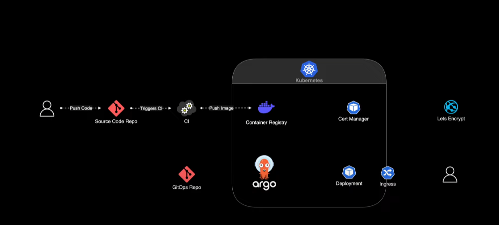

# api-utec-customer-microservice

api-utec-customer-microservice

<!-- TOC -->

* [api-utec-customer-microservice](#api-utec-customer-microservice)
* [📖 Overview](#-overview)
* [📑 Prerequisite](#-prerequisite)
* [🖥️ Technologies](#-technologies)
    * [Language](#language)
    * [Architecture](#architecture)
* [⚙️ Spring Boot Dependencies 🧱](#-spring-boot-dependencies-)
* [🚀 Deploy](#-deploy)

<!-- TOC -->

# 📖 Overview

# 📑 Prerequisite

| Name | Version |
|:----:|:-------:|
| JDK  |   17    |

# 🖥️ Technologies

## Language

## Architecture

# ⚙️ Spring Boot Dependencies 🧱

# 🚀 Deploy

|    Cluster     | eks  |
|:--------------:|:----:|
| utec-group-eks | 1.30 |

```batch
aws eks --region us-east-1 update-kubeconfig --name cbaciliod-test-eks
kubectl cluster-info

```

```batch
kubectl get nodes
```

| NAME                        | STATUS | ROLES  | AGE |       VERSION       |
|:----------------------------|:------:|:------:|:---:|:-------------------:|
| ip-172-16-2-81.ec2.internal | Ready  | <none> | 10m | v1.30.2-eks-1552ad0 |

```batch
 kubectl get svc
```

| NAME       |   TYPE    | CLUSTER-IP | EXTERNAL-IP | PORT(S) | AGE |
|:-----------|:---------:|:----------:|:-----------:|:-------:|:----|
| kubernetes | ClusterIP | 10.10.0.1  |   <none>    | 443/TCP | 20m |

```batch
 kubectl get pods
```
Install helm
```batch
helm version
kubectl get all
kubectl create namespace argocd
kubectl get ns
helm repo list
helm install argocd argo/argo-cd --namespace argocd
helm list -n argocd
kubectl get pod -n argocd
kubectl get svc
kubectl get svc

```
```
$ helm install argocd argo/argo-cd --namespace argocd
NAME: argocd
LAST DEPLOYED: Fri Aug  2 18:41:15 2024
NAMESPACE: argocd
STATUS: deployed
REVISION: 1
TEST SUITE: None
NOTES:
In order to access the server UI you have the following options:

1. kubectl port-forward service/argocd-server -n argocd 8080:443

    and then open the browser on http://localhost:8080 and accept the certificate

2. enable ingress in the values file `server.ingress.enabled` and either
      - Add the annotation for ssl passthrough: https://argo-cd.readthedocs.io/en/stable/operator-manual/ingress/#option-1-ssl-passthrough
      - Set the `configs.params."server.insecure"` in the values file and terminate SSL at your ingress: https://argo-cd.readthedocs.io/en/stable/operator-manual/ingress/#option-2-multiple-ingress-objects-and-hosts


After reaching the UI the first time you can login with username: admin and the random password generated during the installation. You can find the password by running:

kubectl -n argocd get secret argocd-initial-admin-secret -o jsonpath="{.data.password}" | base64 -d
hobC9IamzUf2PtrO
hobC9IamzUf2PtrO
(You should delete the initial secret afterwards as suggested by the Getting Started Guide: https://argo-cd.readthedocs.io/en/stable/getting_started/#4-login-using-the-cli)

```
```
kubectl get svc -n argocd
kubectl edit svc argocd-server -n argocd 
30874/

kubectl port-forward svc/argocd-server -n argocd 8080:443
kubectl -n argocd port-forward argocd-server-5f47b9f594-vptt4  8080:8080 --address 0.0.0.0

 kubectl -n argocd get deployments.app

```



```
helm repo add ingress-nginx https://kubernetes.github.io/ingress-nginx
helm repo update
helm install ingress-nginx ingress-nginx/ingress-nginx --namespace ingress-nginx --create-namespace -f nginx-ingress-values.yml

NAME: ingress-nginx
LAST DEPLOYED: Fri Aug  2 19:47:48 2024
NAMESPACE: ingress-nginx
STATUS: deployed
REVISION: 1
TEST SUITE: None
NOTES:
The ingress-nginx controller has been installed.
It may take a few minutes for the load balancer IP to be available.
You can watch the status by running 'kubectl get service --namespace ingress-nginx ingress-nginx-controller --output wide --watch'

An example Ingress that makes use of the controller:
  apiVersion: networking.k8s.io/v1
  kind: Ingress
  metadata:
    name: example
    namespace: foo
  spec:
    ingressClassName: nginx
    rules:
      - host: www.example.com
        http:
          paths:
            - pathType: Prefix
              backend:
                service:
                  name: exampleService
                  port:
                    number: 80
              path: /
    # This section is only required if TLS is to be enabled for the Ingress
    tls:
      - hosts:
        - www.example.com
        secretName: example-tls

If TLS is enabled for the Ingress, a Secret containing the certificate and key must also be provided:

  apiVersion: v1
  kind: Secret
  metadata:
    name: example-tls
    namespace: foo
  data:
    tls.crt: <base64 encoded cert>
    tls.key: <base64 encoded key>
  type: kubernetes.io/tls

```
```
helm repo add jetstack https://charts.jetstack.io
helm repo update jetstack
 helm install cert-manager jetstack/cert-manager --namespace cert-manager --create-namespace -f cert-manager-values.yml
NAME: cert-manager
LAST DEPLOYED: Fri Aug  2 19:54:58 2024
NAMESPACE: cert-manager
STATUS: deployed
REVISION: 1
TEST SUITE: None
NOTES:
⚠️  WARNING: `installCRDs` is deprecated, use `crds.enabled` instead.
cert-manager v1.15.2 has been deployed successfully!

In order to begin issuing certificates, you will need to set up a ClusterIssuer
or Issuer resource (for example, by creating a 'letsencrypt-staging' issuer).

More information on the different types of issuers and how to configure them
can be found in our documentation:

https://cert-manager.io/docs/configuration/

For information on how to configure cert-manager to automatically provision
Certificates for Ingress resources, take a look at the `ingress-shim`
documentation:

https://cert-manager.io/docs/usage/ingress/

bxcode@cbaciliod MINGW64 /d/java/utec/api-utec-customer-microservice/deploy (master)
$

```